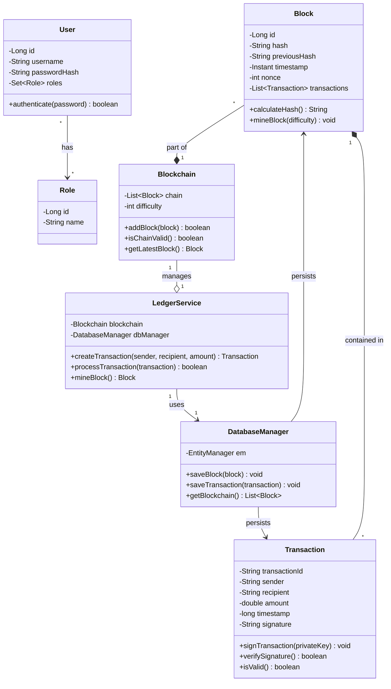

# Class Diagram - Core Components

This class diagram illustrates the core components of the QuantumLedger system and their relationships:

1. **Block**
   - Core data structure containing transactions
   - Implements mining with proof of work
   - Maintains chain integrity through previous hash

2. **Transaction**
   - Represents financial transfers between parties
   - Includes digital signatures and validation
   - Self-contained validation logic

3. **Blockchain**
   - Manages the chain of blocks
   - Enforces chain validity rules
   - Controls mining difficulty

4. **LedgerService**
   - Orchestrates blockchain operations
   - Processes transactions
   - Manages block creation and mining

5. **DatabaseManager**
   - Handles persistence using JPA/Hibernate
   - Manages entity lifecycles
   - Provides data access methods

6. **User & Role**
   - Implements authentication and authorization
   - Supports role-based access control
   - Uses secure password hashing

The diagram shows both the structure and relationships between components, helping developers understand the system architecture and data flow.
