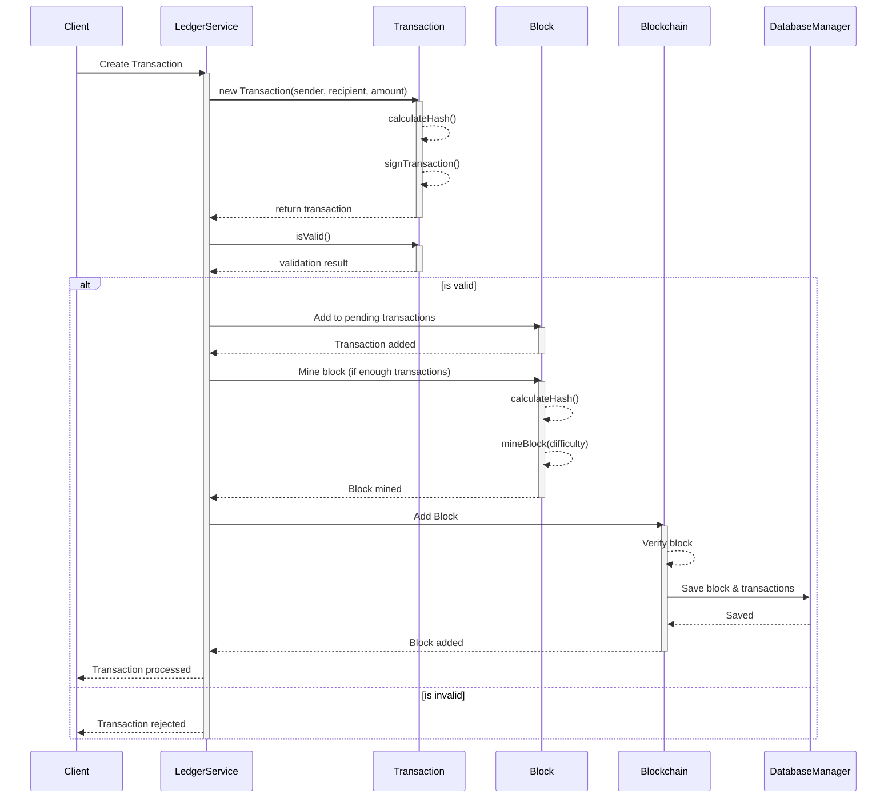

# Transaction Flow Diagram

This sequence diagram illustrates the flow of a transaction in the QuantumLedger blockchain system:

1. **Client Initiation**: The process begins when a client requests to create a transaction.

2. **Transaction Creation**:
   - LedgerService creates a new Transaction object
   - Transaction generates its hash and digital signature
   - Basic validation is performed

3. **Transaction Processing**:
   - Valid transactions are added to pending transactions in a Block
   - When enough transactions are collected, block mining begins
   - Block calculates its hash and performs Proof of Work

4. **Block Addition**:
   - New block is verified and added to the blockchain
   - Block and its transactions are persisted to the database
   - Confirmation is sent back to the client

5. **Error Handling**:
   - Invalid transactions are rejected immediately
   - Validation occurs at multiple levels
   - Each step includes proper error handling
